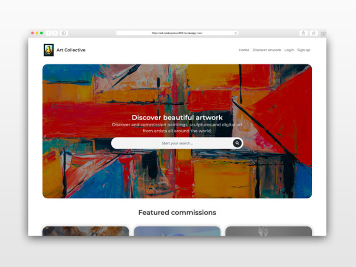

<h1>Art Collective: A digital art marketplace</h1>

## Description

Art Collective is a small web application that enables individuals to commission customized artworks from artists all over the world. This application was built over one week during our Le Wagon Batch #803 web development bootcamp in Lisbon.

## Links

- [Repo](https://github.com/niznet89/rbnb)

- [Live](https://art-marketplace-803.herokuapp.com)

## Homepage Screenshot

## Built With

- [Ruby on Rails](https://rubyonrails.org/)
- JavaScript
- [Webpack](https://webpack.js.org/)
- [Yarn](https://yarnpkg.com/)
- [PostgreSQL](https://www.postgresql.org/)
- HTML
- CSS
- [Bootstrap](https://getbootstrap.com/)

## Contributors

**Joshua Merrill**

- [Profile](https://github.com/josh-merrill)
- [Email](mailto:joshmmerrill@outlook.com?subject=Hello!)
- [Website](https://troopl.com/joshmerrill)

**Tenzin Rose**

- [Profile](https://github.com/niznet89)

**Tempestt Woodard**

- [Profile](https://github.com/tnwoodard)

## 🤝 Support

Contributions, issues, and feature requests are welcome!

Give a ⭐️ if you like this project!
